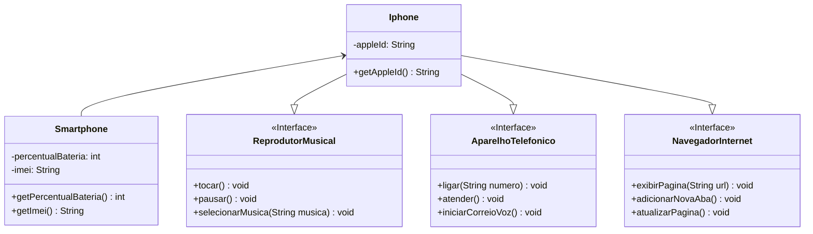

```mermaid
classDiagram
    class Smartphone {
	    -percentualBateria: int
	    -imei: String
	    +getPercentualBateria() int
	    +getImei() String
    }
    class Iphone {
	    -appleId: String
	    +getAppleId() String
    }
    class ReprodutorMusical {
	    +tocar() void
	    +pausar() void
	    +selecionarMusica(String musica) void
    }
    class AparelhoTelefonico {
	    +ligar(String numero) void
	    +atender() void
	    +iniciarCorreioVoz() void
    }
    class NavegadorInternet {
	    +exibirPagina(String url) void
	    +adicionarNovaAba() void
	    +atualizarPagina() void
    }

	<<Interface>> ReprodutorMusical
	<<Interface>> AparelhoTelefonico
	<<Interface>> NavegadorInternet

    Iphone <-- Smartphone
    Iphone --|> ReprodutorMusical
    Iphone --|> AparelhoTelefonico
    Iphone --|> NavegadorInternet
```
